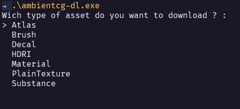
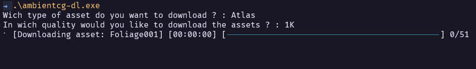

# AmbientCG Downloader

AmbientCG Downloader is a command-line tool that allows you to easily download assets from AmbientCG.com. It provides a simple interface for selecting the type and quality of assets you want to download.

## Features

- Download assets from AmbientCG.com effortlessly.
- Choose from various asset types, including Atlas, Brush, Decal, HDRI, Material, PlainTexture, and Substance.
- Select the desired quality for assets, with support for different resolutions.
- Monitor the progress of asset downloads with a user-friendly progress bar.
- Automatically extract downloaded zip files for easy access to asset files.

## Installation
Download the repo and build with cargo

## Contributing

Contributions are welcome! If you have any suggestions, feature requests, or bug reports, please open an issue or create a pull request on the GitHub repository.
